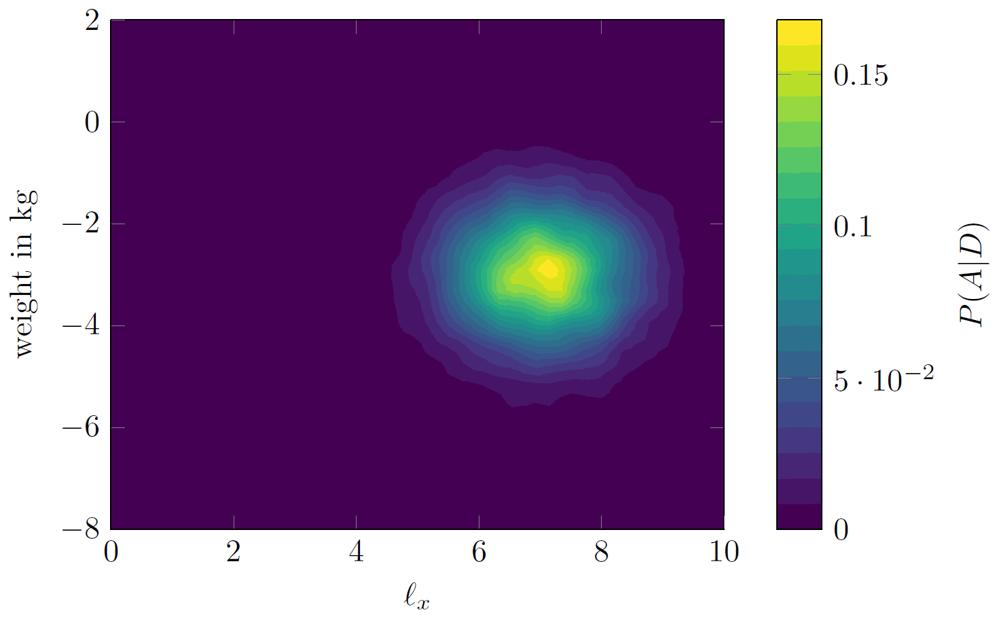
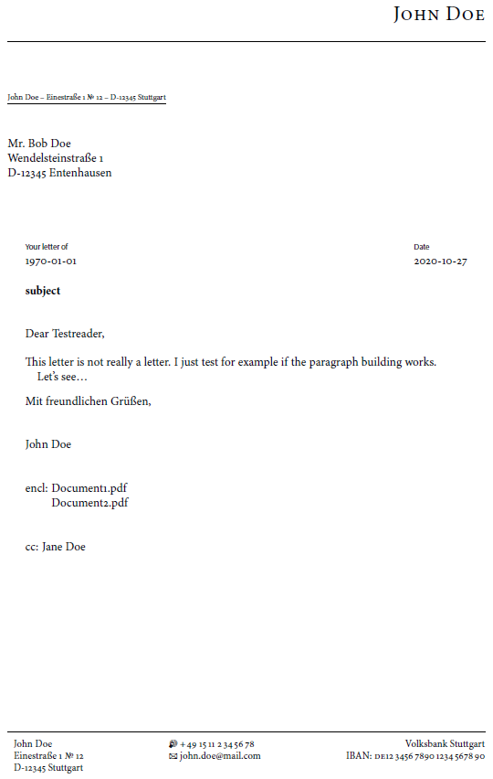

# Jatex

[](https://github.com/uhoefel/jatex/issues)
[](https://github.com/uhoefel/jatex/stargazers)
[](https://zenodo.org/badge/latestdoi/308012469)
[](https://search.maven.org/search?q=g:%22eu.hoefel%22%20AND%20a:%22jatex%22)
[](https://choosealicense.com/licenses/mit/)

Jatex is a [Java](https://openjdk.java.net/) library designed to programmatically write [LaTeX](https://www.latex-project.org/) files and run them.
It is designed to allow generic LaTeX documents, but provide reasonable defaults for ease of use.
Some of the supported features include:
- pdflatex, [lualatex](http://www.luatex.org/) (default), xetex, ...
- [biblatex](https://ctan.org/pkg/biblatex) support
- [tikz](https://www.ctan.org/pkg/pgf)/[pgfplots](https://www.ctan.org/pkg/pgfplots), including tikzexternalize
- [amsmath](https://www.ctan.org/pkg/amsmath), including all types of equation environments, including starred environments
- figures, including [wrapfig](https://www.ctan.org/pkg/wrapfig)
- tables, including [longtable](https://www.ctan.org/pkg/longtable)
- warns about incompatible packages (if metadata is correctly incorporated)

Example usage for pgfplots:
```java
PgfPlots.contourOf(x, y, pdfvalues, Map.of("contour filled", "{number=20}"))
        .xlabel("$\\ell_{x}$")
        .ylabel("weight in kg")
        .clabel("$P(A|D)$")
        .exec("yourPathToSaveTo");
```
wherein `x` and `y`are 1D double arrays and `pdfvalues` is a 2D array of size `[x.length][y.length]`. This produces a pdf looking as follows:



Furthermore, a convenience class for writing letters (via [scrlttr2](https://www.ctan.org/pkg/scrlttr2)) is provided. Example usage:
```java
KomaLetter.as("yourPathToSaveTo")
          .user(JohnDoe.defaults()) // fill in specifics for yourself
          .toName("Mr. Bob Doe")
          .cc("Jane Doe")
          .toStreet("Wendelsteinstraße 1")
          .toCity("D-12345 Entenhausen")
          .yourMail("1970-01-01")
          .subject("subject")
          .opening("Dear Testreader,")
          .write("This letter is not really a letter. I just test for example if the paragraph building works.",
                 "Let's see\\ldots")
          .closing("Mit freundlichen Grüßen,")
          .encl("Document1.pdf", "Document2.pdf")
          .exec();
```
producing



Finally, an annotation for [JUnit 5](https://junit.org/junit5/) is provided to execute tests only if the chosen compiler is available and executable:
```java
@Test
@EnabledIfLatexExecutable(compiler = TexCompiler.LUALATEX)
void testSomething() {
...
```

Installation
============

The artifact can be found at maven central:
```xml
<dependency>
    <groupId>eu.hoefel</groupId>
    <artifactId>jatex</artifactId>
    <version>1.1.0</version>
</dependency>
```

Requirements
============
Jatex is designed to work with Java 17+. It also needs a LaTeX distribution, like e.g. [MikTeX](https://miktex.org/).